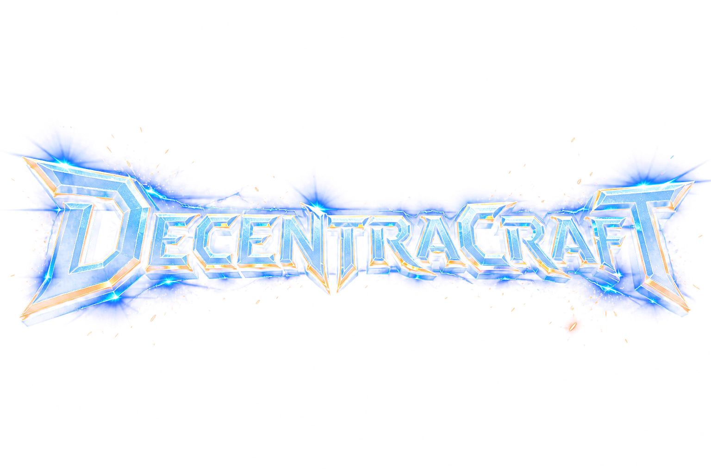
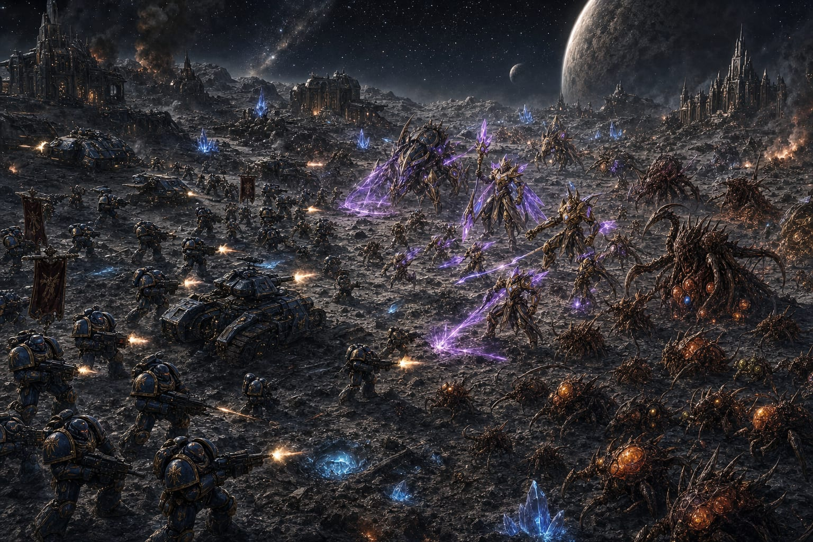
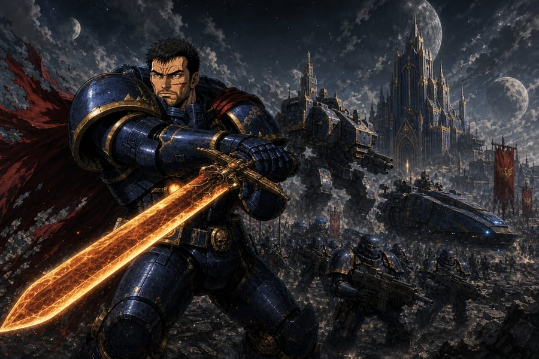
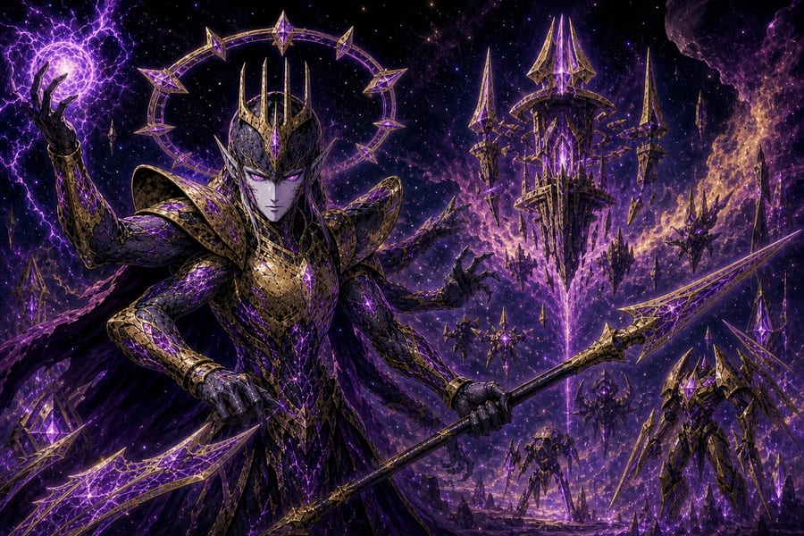
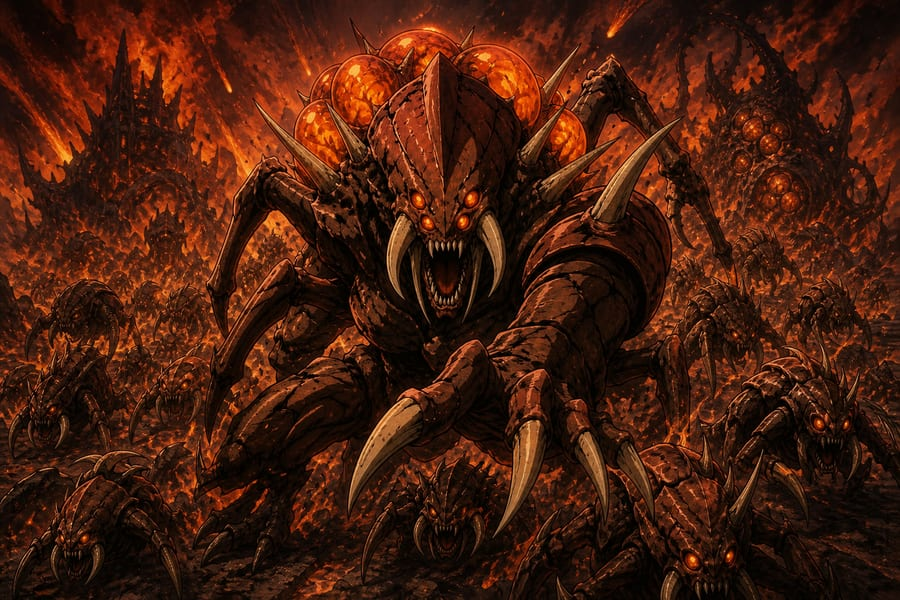
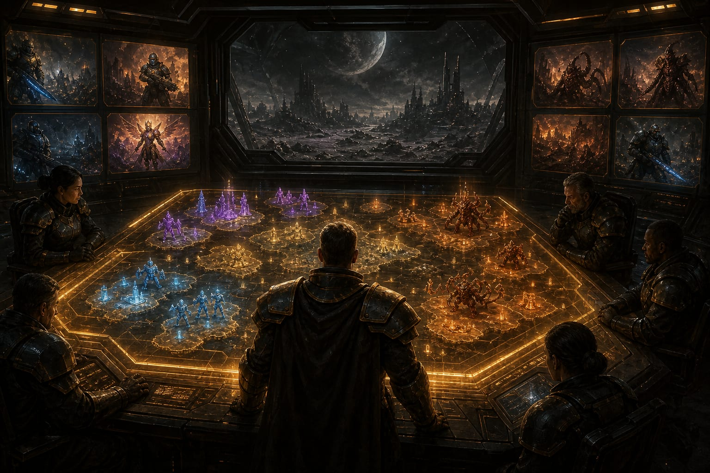

<p align="center">
  
</p>

<p align="center">
  <strong>Build the base. Raise the army. Break the enemy.</strong><br/>
  A full real-time strategy game living inside Decentraland.
</p>

<p align="center">
  <a href="https://play.decentraland.org/?NETWORK=mainnet&position=-17,123"></a>
  <a href="https://decentracraft.app"></a>
  <a href="https://decentracraft.app/#ladder"></a>
</p>

<p align="center">
  
</p>

---

Three hundred years of aether crystal made the Kingdom of Antrom rich enough to stop asking where the veins came from. A deep bore answered: they were never ore. They were the **Aethyr**, entombed and dreaming. Their waking split the Crown Mountains and broke the kingdom with them.

What is left are battlegrounds — and three banners over the ruins.

<table>
  <tr>
    <td width="33%" valign="top">
      
      <h3 align="center">VANGUARD</h3>
      <p align="center"><em>Exiled colonists. The last army of Antrom.</em></p>
      <p>Balanced steel and fire. Repair crews weld structures and mech back together faster than anyone else. Lead them as <strong>Warmaster Kael</strong> — Battle Standard, Rally Cry.</p>
    </td>
    <td width="33%" valign="top">
      
      <h3 align="center">AETHYR</h3>
      <p align="center"><em>Ancient tech. They were the crystal.</em></p>
      <p>Devastating units. Seed a structure and walk away — it assembles itself. Lead them as <strong>Riftlord Auren</strong> — Aetheric Ward, Rift Nova.</p>
    </td>
    <td width="33%" valign="top">
      
      <h3 align="center">MYRIAD</h3>
      <p align="center"><em>The living horde. Cheap, fast, endless.</em></p>
      <p>Every living thing regenerates. The swarm never stays wounded for long. Lead them as <strong>Broodmother Szel</strong> — Endless Brood, Birth Surge.</p>
    </td>
  </tr>
</table>

<p align="center">
  
</p>

## Play

| | |
| --- | --- |
| **Campaign** | Three 8-mission stories. Sequential unlock. Portraits when you clear a banner. The Shattered Crown if you clear all 24. |
| **Skirmish** | Solo war against the computer. Up to five AI commanders. |
| **Multiplayer** | Battle rooms on an authoritative server. Claim a seat, pick a race, ready up. |
| **Ranked** | Strict free-for-all. Humans only. Elo from 1200. Win and you take rating from everyone you buried. |

**Live world:** [play.decentraland.org](https://play.decentraland.org/?NETWORK=mainnet&position=-17,123) · parcel `-17,123`  
**Site & boards:** [decentracraft.app](https://decentracraft.app)

## Stack

Decentraland **SDK7** scene with an **authoritative server**. Clients render and issue commands. The server owns lobbies, match start, command relay, ranked Elo, commander profiles, and campaign saves.

```text
src/index.ts          client / server entry
src/rtsGame.ts        match loop, combat, construction, AI
src/ui.tsx            HUD, menus, commander profile
src/rts/              races, campaign, maps, session
src/server/main.ts    lobbies, persistence, leaderboards
website/              public site + live board APIs
```

## Run it locally

```bash
npm install
npm start
```

```bash
npm run build
npm run deploy
```

`authoritativeMultiplayer` is on in `scene.json`. Preview starts the headless server next to the client.

## License

Private repository. All rights reserved unless a license is added later.
