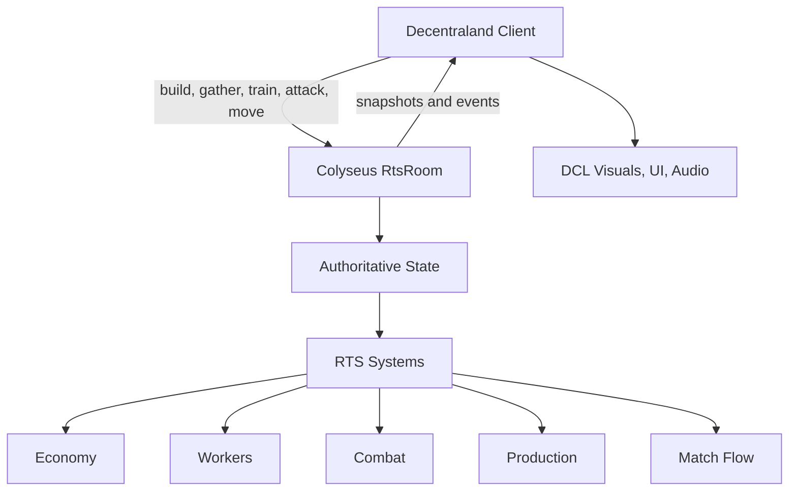

# Kingdom of Antrom Multiplayer Architecture

## Direction

Kingdom of Antrom will use Colyseus as the external authoritative multiplayer server. Decentraland remains the renderer and input layer; Colyseus owns match state, validates commands, advances the RTS simulation, and broadcasts state snapshots to every connected player.

The first multiplayer target is a 1v1 RTS match. The existing enemy AI base position becomes Player 2's starting base.

## Map Layout

```text
Scene: 160 x 160

Z+
160  +--------------------------------------------------+
     |                                  Player 2 Base   |
     |                                  Temple          |
     |                                  x142.89 z136.75 |
     |                                                  |
     |              Shared contested resources           |
     |              rocks / trees / pigs                 |
     |                                                  |
     |  Player 1 Base                                   |
     |  Temple                                          |
  0  |  x8.54 z3.48                                     |
     +--------------------------------------------------+ X+
        0                                          160
```

Player 1 starts at the current player Temple. Player 2 starts at the current enemy Temple. New Temples become expansion anchors and extend the player's buildable area.

## Server Ownership

The Colyseus room owns:

- Match status, timer, result, and post-game stats.
- Player slots, teams, resources, supply, queues, and ownership.
- Workers, guards, buildings, construction sites, rally points, resources, and depletion.
- Enemy/player combat resolution, worker deaths, building deaths, and win/loss checks.
- AI behavior for empty slots or future co-op/AI modes.

The Decentraland client owns:

- Pointer input, keyboard shortcuts, placement previews, selection UI, and command cards.
- Rendering GLB models, selection markers, rally markers, sounds, and local animation playback.
- Sending player commands to the server.
- Applying server snapshots/events to local visual entities.

## Command Flow



## Initial Build Rules

- Players may place buildings only inside the 160 x 160 map.
- Buildings cannot overlap existing buildings, units, or resources.
- Workers must be alive and owned by the issuing player to build.
- Players must have enough resources before a build or train command is accepted.
- New buildings should be near an owned Temple, with expansions enabled by building more Temples.
- Guards can attack buildings, guards, and workers owned by the other team.

## Migration Plan

1. Keep the current local RTS working while adding a Colyseus server package.
2. Create a minimal room that assigns Player 1 and Player 2 slots and broadcasts match state.
3. Add a Decentraland adapter that connects to the room and displays multiplayer connection state.
4. Move economy and match state to the server.
5. Move production, construction, gathering, and combat to the server.
6. Replace local AI opponent with either Player 2 or server-controlled AI when a second player is absent.
